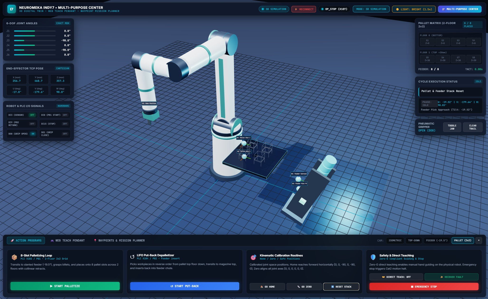

# Neuromeka Indy7 3D Digital Twin & Palletizing Workcell

A robotics integration project combining a **Three.js workcell visualization**, **Python/FastAPI backend**, and **operator controls** for the Neuromeka Indy7 collaborative robot. It supports a hardware-free simulation and an optional IndyDCP3 controller connection.

## Portfolio foundation milestone

The application now starts in **simulation on localhost**, with no robot connection attempted during import or default startup. REST, WebSocket, and physical program starts share command validation and execution ownership. The Workcell panel exposes state, simulated faults, recovery, and command outcomes.

- [Architecture, behavior, and current limitations](docs/foundation.md)
- [Repeatable demonstration and verification](docs/demo.md)
- [Recorded simulation baseline](artifacts/simulation-baseline.json)
- [Remaining portfolio roadmap](docs/roadmap.md)

Run the behavior and HTTP/WebSocket integration tests with `uv run python -m unittest discover -s tests -v`.

**Validation scope:** The linked baseline records a simulation run, not measured robot performance. Hardware command paths are implemented, but the foundation documentation does not claim hardware-in-the-loop validation. See the [demo and verification guide](docs/demo.md) for repeatable checks.




---

## Key Features

- **Real-Time 3D Digital Twin**:
  - Live 3D robot model visualized in WebGL using Modified Denavit-Hartenberg (Craig MDH) forward kinematics.
  - Interactive camera control (OrbitControls), link highlighting, coordinate frames, and feeder/pallet scenery.
  - Dynamic dual-jaw pneumatic gripper and workpiece visualization with state transitions.

- **Dual-Mode Operation**:
  - **Simulation Mode**: Run backend quintic kinematic interpolation without physical hardware. Cartesian paths use numerical inverse kinematics to animate the robot joints with a consistent TCP pose. Unreachable or discontinuous paths fault before playback. Collision checking, dynamics, and hardware joint-limit validation are not modeled.
  - **Live Hardware Control**: Connect to the real Indy7 controller via TCP/IP using Neuromeka `IndyDCP3`.

- **Palletizing & Motion Engine**:
  - Pure Cartesian `MoveL` collinear approach and retraction motions along tool orientation vector ($U, V, W$).
  - Palletizing and put-back routines with coordinate calculation for grid slots and multi-layer palletizing.
  - Physical PLC industrial I/O trigger integration (DI8 for palletize, DI9 for put-back, DI15 for application stop). This application is not a safety-rated emergency-stop system.

- **Multi-Purpose Control Center**:
  - **Web Teach Pendant**: Joint space ($\pm J_1 \dots J_6$) and Cartesian task space ($\pm X, Y, Z, U, V, W$) jog commands.
  - **Zero-G Direct Teaching**: Real-time hand-guiding mode with live coordinate tracking.
  - **Waypoint Management**: Capture, name, save, inspect, and replay custom waypoint programs from a persistent JSON database.

---

## Architecture & Project Structure

```text
neuromeka-digitaltwin/
├── run_digitaltwin.py         # Application launcher script
├── pyproject.toml             # Dependencies & project metadata
├── uv.lock                    # Dependency lockfile
└── src/
    └── digitaltwin/
        ├── config.py          # Workcell geometry, locations, I/O pin mappings
        ├── kinematics.py      # MDH parameters, FK Craig transforms, quintic interpolation
        ├── palletizer_engine.py # Core motion engine, hardware DCP3 interface & telemetry
        ├── server.py          # FastAPI REST & WebSocket server
        ├── waypoints.json     # Saved waypoints storage
        └── static/
            ├── index.html     # Responsive control room & 3D viewport layout
            ├── style.css      # Dark-mode industrial cyber-style UI
            ├── digitaltwin.js # Three.js scene, robot meshes, HUD, and telemetry client
            ├── three.min.js   # Three.js library bundle
            └── OrbitControls.js # 3D viewport camera control
```

---

## Getting Started

### 1. Prerequisites
- Python 3.12+
- [uv](https://github.com/astral-sh/uv) (recommended) or standard `pip`

### 2. Install Dependencies
```bash
# Clone the repository
git clone https://github.com/se4nchoi/neuromeka-digitaltwin.git
cd neuromeka-digitaltwin

# Install dependencies using uv
uv sync --frozen
```

*Note: For live hardware execution, install the official Neuromeka Python DCP package:*
```bash
git clone https://github.com/neuromeka-robotics/neuromeka-package.git
pip install -e neuromeka-package/python
```

### 3. Run the Digital Twin
```bash
uv run python run_digitaltwin.py
```

Open your browser and navigate to:
```text
http://localhost:8088
```

The default binds to `127.0.0.1`. For explicit hardware startup in PowerShell, install the optional Neuromeka SDK first, then run:

```powershell
$env:DIGITALTWIN_MODE = "HARDWARE_LIVE"
$env:DIGITALTWIN_ROBOT_IP = "192.168.3.7"
uv run python run_digitaltwin.py
```

Set `DIGITALTWIN_MODE` back to `SIMULATION` for the hardware-free demo. Geometry and I/O mappings remain in `src/digitaltwin/config.py`; environment options are listed in `.env.example` (not automatically loaded).
