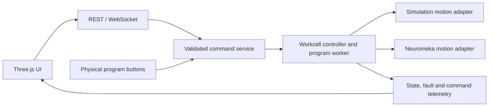

# Workcell foundation

## Scope

This milestone establishes a hardware-free startup, shared command boundary, motion adapters, program ownership, fault injection, and explicit recovery. Production persistence, work orders, KPI analysis, and AI are subsequent milestones.

`commands.py` owns validation and user-command conflict checks. `palletizer_engine.py` owns inventory, sequences, stop/fault latches, command history, and thread lifecycle. `drivers.py` separates synchronous motion execution for simulation and hardware. Legacy manual jogging, connection management, gripper I/O, and hardware polling remain in the engine; complete I/O-driver extraction is still a follow-up.

The engine is constructed without I/O. FastAPI lifespan starts polling and cancels telemetry on shutdown; shutdown requests a stop and joins workers with bounded waits. Optional hardware startup is selected through `DIGITALTWIN_MODE`. Only run one API worker: process-local equipment ownership does not coordinate multiple processes.

## Command contract

POST `/api/commands` accepts a JSON command, for example `{"cmd":"pb1"}`. Existing action endpoints remain available and use the same command service. WebSocket clients send the same object to `/ws/telemetry`; replies include `type: command_result`, while ordinary telemetry retains its existing structure.

Each result contains `command_id`, `cmd`, `status`, and `success`. Long programs return `accepted`, transition to `running`, then end in `completed`, `failed`, or `cancelled`. Read `/api/commands/{command_id}` for the final result. `success: true` on an accepted command means acceptance, not completed motion. Invalid/conflicting commands return `rejected` with a message. Legacy synchronous hardware commands acknowledge SDK acceptance; actual physical completion of manual jogging is not tracked as a program.

Command history is bounded to 100 in-memory records and fault history to 100 events. Both reset when the process restarts. A later persistence milestone will replace these limits with a durable event store.

Program ownership is reserved under the engine lock before worker creation. While a worker is active, other action commands are rejected except stop/jog-stop and simulated fault injection. Recovery cannot release an unfinished worker. Home, zero, waypoint, palletize and put-back programs share this ownership mechanism. Waypoint sequences snapshot their inputs when started.

## State and recovery

The reported state is derived from explicit fault/stop/connection latches and worker activity:

| State | Meaning | Exit |
| --- | --- | --- |
| IDLE | No active worker, stop latch, or fault | Accept a program |
| RUNNING | Program or observed motion active | Complete, stop, or fault |
| STOPPED | Application stop/abort latched | Wait for worker, then Recover |
| FAULTED | Fault latched with timestamp and interrupted step | Resolve cause, reconcile inventory, then Recover |
| DISCONNECTED | No hardware connection and simulation not selected | Explicit reconnect or select simulation |

Releasing Stop does not clear the abort latch. Recover is a separate command. Interrupted programs do not resume; the next start begins a new program from the current inventory. When a part is held, recovery requires reconciliation; the simulation-only inventory reset provides a reproducible clean state. Hardware reconciliation requires an operator procedure and is not automated here.

`FEEDER_EMPTY`, `SENSOR_TIMEOUT`, `MOTION_TIMEOUT`, and `CONNECTION_LOST` can be injected only in simulation. These injection controls directly exercise the fault handler; they do not simulate a network stack, delayed sensor waveform, or a sensor timeout detector. Hardware motion polling detects timeout and controller stop states; connection polling latches connection loss and disables automatic reconnect on failure. Feeder state is checked before picking each part. A full pallet is a rejected start condition, not an equipment fault.

The application stop requests a controller motion halt. It is **not a safety-rated emergency stop** and does not replace physical safety equipment. Hardware recovery and stop behavior have not been validated on an attached robot in this milestone.

## Simulation fidelity and validation

Joint interpolation updates joint angles and forward kinematics. Cartesian paths now use seeded numerical inverse kinematics against the same Craig chain as the viewer. Position follows a straight quintic-blended path; orientation follows the shortest rotation rather than interpolating Euler angles across their wrap boundary. Each frame updates joint angles and derives TCP pose from forward kinematics. Paths are preflighted and fault before playback if IK fails or adjacent samples require a joint jump above 15 degrees. This continuity threshold is a simulator guard, not a hardware velocity limit. Cartesian jogging uses this path too.

Motion durations remain fixed and do not represent acceleration limits, configured speed ratios, collision constraints, gripper physics, or measured hardware cycle time. Hardware joint limits are not validated. Numerical pose tolerances establish internal model consistency, not measured physical accuracy.

The baseline artifact records a full eight-part run, observed joint ranges, and maximum forward-kinematics position error against published TCP pose. The original foundation inventory tests replace motion; the added Cartesian-motion tests run all IK/motion samples for palletize and put-back, replacing only wall-clock waits. They check continuous joints, straight TCP paths, orientation, cancellation, and unreachable targets. HTTP/WebSocket tests start an isolated local server and exercise real networking. CI configuration is included but has not been run on the remote CI service.

Remaining engineering gaps include fully typed waypoint schemas, durable events, authenticated hardware access, slow-client isolation at larger client counts, and hardware-in-the-loop validation. The default localhost binding supports a local demonstration; public hardware-control deployment is outside this milestone.
